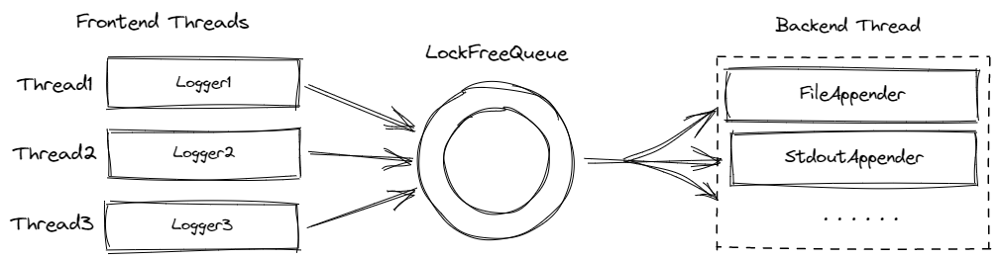

# Cpp Log

一个使用无锁队列[1]的 前后端分离 · 流式 · 日志库

## 整体介绍



该日志库分离出日志前端和后端:

1. 前端负责收集日志信息并将日志格式化，格式化后将日志字符串添加到 `LockFreeQueue` 中
2. 后端负责检查 `LockFreeQueue` 中是否有待输出日志。如果 `LockFreeQueue` 非空，则将其输出到 `LogAppender` 中。这里的 `LogAppender` 定义了日志的输出位置。

## 性能

**操作系统**：本人使用 Wsl-Arch 系统

**日志内容**：1000000 条简单 Info 内容，只向文件输出，最后日志文件的总大小为 64000000B(61.03MB)

```cpp
...
for (int i = 0; i < 1000000; ++i) {
  LOG_INFO() << "ABCDEFGHIJKLMNOPQRSTUVWXYZ0123456789";
}
...
```

**测试结果**：

|              类型               | 平均耗时(测试 10 次取平均) |  吞吐率   |
| :-----------------------------: | :------------------------: | :-------: |
|             单线程              |          3261.5ms          | 18.71MB/s |
|            10 个线程            |         12417.2ms          | 4.92MB/s  |
| 使用 fstream 写入同样大小的文件 |         1931.27ms          | 31.60MB/s |

## 示例

示例文件：

```cpp
#include "log.h"

int main() {
  LOG_INFO() << "This is Info.";
  LOG_WARN() << "This is Warn.";
}
```

控制台输出：

```bash
[22:53:46] [7313] [info]  This is Info.
[22:53:46] [7313] [warn]  This is Warn.
```

## 待做

- [ ] 添加日志 buffer，减少`LockFreeQueue` 的操作频率
- [ ] 更自由的输出格式配置
- [ ] 更多的日志输出方式
- [ ] ...

## 参考

1. [无锁队列的实现- Github](https://github.com/gongyiling/cpp_lecture/tree/main/lockfree)
